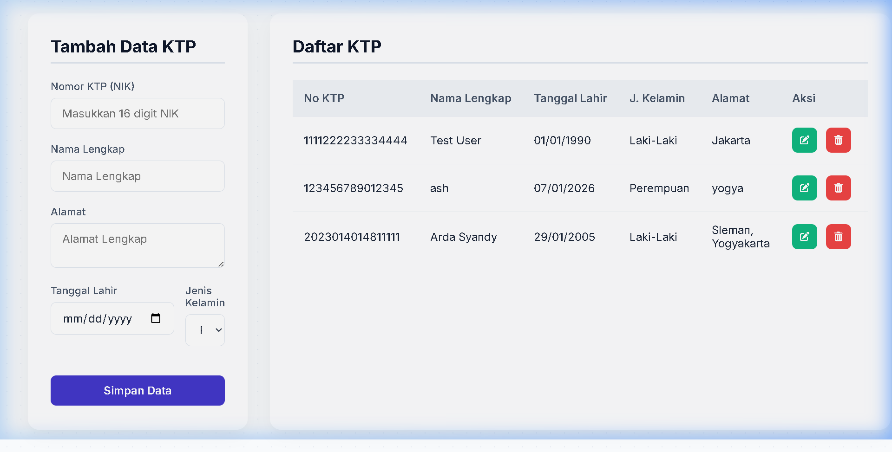

# Tugas CRUD KTP - Spring Boot & MySQL

Sistem Manajemen KTP sederhana yang dibangun menggunakan Spring Boot untuk backend REST API dan HTML/CSS/JS (JQuery Ajax) untuk frontend.

## Fitur
- **Create**: Menambah data KTP baru dengan validasi NIK unik.
- **Read**: Menampilkan daftar data KTP dalam tabel secara dinamis.
- **Update**: Memperbarui data KTP yang sudah ada.
- **Delete**: Menghapus data KTP berdasarkan ID.
- **Asynchronus**: Seluruh operasi CRUD dilakukan tanpa refresh halaman menggunakan AJAX.

## Teknologi
- **Backend**: Spring Boot 4.0.3, Spring Data JPA, Lombok, MapStruct, MySQL Connector.
- **Frontend**: HTML5, CSS3 (Modern Glassmorphism UI), JavaScript, JQuery 3.6.0.
- **Database**: MySQL.
- **Library Tambahan**: SweetAlert2 (Notifikasi), Font Awesome (Ikon), Inter Font.

## Prasyarat
- Java 25
- MySQL Server
- Maven

## Cara Menjalankan
1. Buat database di MySQL dengan nama `spring`.
2. Sesuaikan konfigurasi database di file `.env` atau `application.properties`.
3. Jalankan aplikasi menggunakan Maven:
   ```bash
   ./mvnw spring-boot:run
   ```
4. Buka browser dan akses `http://localhost:8080`.

## API Documentation
- `POST /ktp` : Menambah data KTP baru.
- `GET /ktp` : Mengambil seluruh data KTP.
- `GET /ktp/{id}` : Mengambil data KTP berdasarkan ID.
- `PUT /ktp/{id}` : Memperbarui data KTP berdasarkan ID.
- `DELETE /ktp/{id}` : Menghapus data KTP berdasarkan ID.

## Struktur Project
```text
src/main/java/com/example/praktikum2/
├── controller/    # REST API Endpoints
├── dto/           # Data Transfer Objects
├── entity/        # JPA Entities
├── impl/          # Service Implementations
├── mapper/        # MapStruct Mappers
├── model/         # Response Models
├── repository/    # Spring Data JPA Repositories
├── service/       # Service Interfaces
└── util/          # Global Exception Handlers
```

## Screenshot
Tampilan Sistem Manajemen KTP:


---
**NIM**: 20230140148
**Nama**: Syandy Arda
